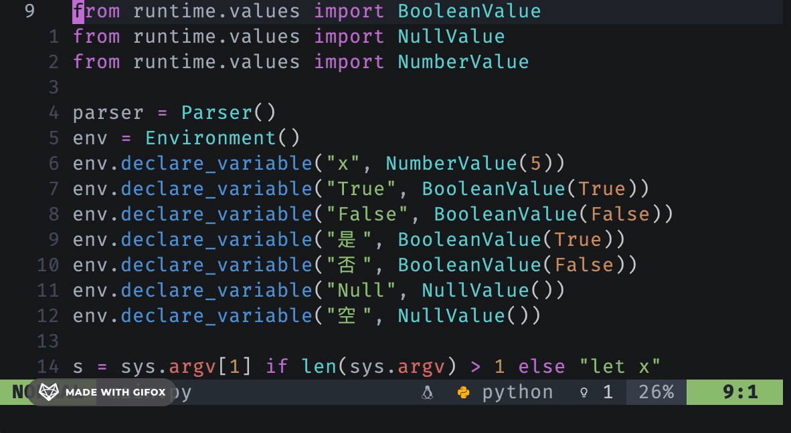

# Syntax Highlighted Cursor

Use your synatx highlighting color for the neovim cursor.




## Inspirations

- [st - simple terminal](https://st.suckless.org/patches/dynamic-cursor-color/)
- [kovidgoyal/kitty](https://github.com/kovidgoyal/kitty/issues/126)
- [asottile/babi]()


## Installation

If you use [lazy.nvim](https://github.com/folke/lazy.nvim), add:

```lua
{
    "ukyouz/syntax-highlighted-cursor.nvim",
},
```

## Options


```lua
{
    -- If you feel updating cursor color is too often for you, try make debounce_ms bigger.
    debounce_ms = 50,

    -- If your cursor color not change immediately, try set this to true
    -- This setting adds a keymap for `:` to iteslf with quiet flag,
    -- and let vim enter command mode for a moment
    -- to force GUI refreshing cursor color.
    force_refresh_hack = false,

    -- Update Color on every cursor move
    -- If you feel laggy, try set this to false
    when_cursor_moved = true,

    -- Update Color on every cursor hold (delay is updatetime)
    when_cursor_hold = false,
}
```

## Limitations

- Required Lua, so only work in Neovim
- Required `guicursor` support
